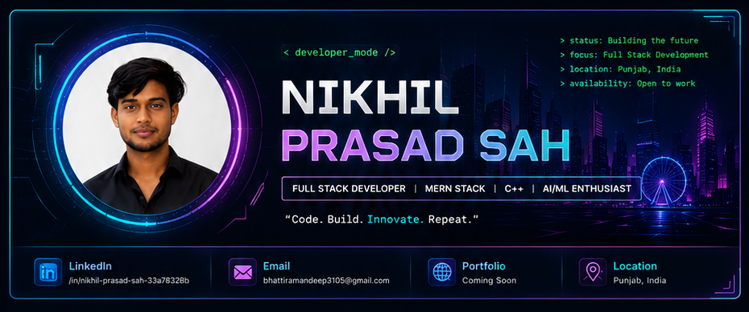

<div align="center">



<br/>


# Hi, I'm Nikhil Prasad Sah 👋

### Full-Stack Developer • MERN Stack • C++ • AI/ML Enthusiast


<br/>

<a href="https://www.linkedin.com/in/nikhil-prasad-sah-33a78328b">
  
</a>
<a href="#contact">
  
</a>
<a href="#portfolio">
  
</a>

<br/><br/>


</div>

---

## 👨‍💻 About Me

```yaml
name: Nikhil Prasad Sah
role: Aspiring Software Engineer and Full-Stack Developer
education: Final-year B.Tech in Computer Science and Engineering
location: Punjab, India
focus:
  - Full-Stack Development
  - Data Structures and Algorithms
  - AI and Machine Learning
currently_building:
  - Code Ninja Learning Platform
  - MediRescue
  - AI Fake News Detector
goal: Build scalable, useful and user-friendly software products
availability: Open to internships and entry-level software roles
```

- 🔭 I build practical projects using the **MERN stack, C++, Python and databases**.
- 🌱 I am improving my skills in **system design, REST APIs, deployment and problem solving**.
- 🧠 I enjoy converting real-world problems into simple software solutions.
- 🤝 I am open to collaborating on meaningful full-stack and AI projects.
- ⚡ My approach: **Learn → Build → Debug → Improve → Repeat**.

---

## 🚀 Quick Orbit

<table>
<tr>
<td width="50%">

### 🎓 Current Status

Final-year **B.Tech CSE** student focused on becoming an industry-ready software developer.

</td>
<td width="50%">

### 🎯 Current Focus

Building deployable projects, improving DSA, and strengthening full-stack fundamentals.

</td>
</tr>
<tr>
<td width="50%">

### 💼 Looking For

Software Developer, Frontend Developer, Full-Stack Developer and AI/ML fresher opportunities.

</td>
<td width="50%">

### 🤝 Open To

Internships, hackathons, open-source collaboration and entry-level roles.

</td>
</tr>
</table>

---

## 🛠️ Tech Stack & Tools

### Languages

<p>

</p>

### Frontend

<p>

</p>

### Backend

<p>

</p>

### Databases

<p>

</p>

### Tools and Deployment

<p>

</p>

---

## 🌟 Featured Projects

<table>
<tr>
<td width="50%" valign="top">

### 🎓 Code Ninja Learning Platform

A gamified learning platform where students can register, explore courses, complete missions, take quizzes and track progress.

**Highlights:**
- Authentication and protected routes
- Course and lesson management
- Progress tracking and dashboard
- Responsive modern interface

**Stack:** React, Node.js, Express, MongoDB, Tailwind CSS

</td>
<td width="50%" valign="top">

### 🏥 MediRescue

A C++ hospital emergency management system designed to prioritise patients and organise hospital resources.

**Highlights:**
- OOP-based architecture
- STL containers and algorithms
- Emergency priority handling
- Patient and hospital record management

**Stack:** C++, OOP, STL, File Handling

</td>
</tr>
<tr>
<td width="50%" valign="top">

### 🤖 AI Fake News Detector

A machine-learning application that classifies news text as real or fake using NLP and supervised learning.

**Highlights:**
- Text preprocessing
- TF-IDF feature extraction
- Logistic Regression / Naive Bayes
- Prediction interface and evaluation metrics

**Stack:** Python, Pandas, scikit-learn, NLP

</td>
<td width="50%" valign="top">

### ✅ TaskKeeper

A collaborative task management application with authentication, projects, Kanban boards and real-time features.

**Highlights:**
- JWT authentication
- Project and task CRUD
- Role-based access
- Comments and real-time updates

**Stack:** MERN, Socket.io, JWT

</td>
</tr>
</table>

> Project links will be added here after the repositories are cleaned and deployed.

---

## 📊 GitHub Analytics

<div align="center">


<br/>


<br/>


</div>

---

## 🏆 GitHub Trophies

<div align="center">


</div>

---

## 🐍 Contribution Snake

<div align="center">

<picture>
  <source media="(prefers-color-scheme: dark)" srcset="https://raw.githubusercontent.com/nikhilps01/nikhilps01/output/github-contribution-grid-snake-dark.svg" />
  <source media="(prefers-color-scheme: light)" srcset="https://raw.githubusercontent.com/nikhilps01/nikhilps01/output/github-contribution-grid-snake.svg" />
  
</picture>

</div>

---

## 📚 Learning Roadmap

```text
DSA and Problem Solving
        ↓
Advanced JavaScript and React
        ↓
Backend APIs and Authentication
        ↓
Database Design and Optimization
        ↓
Testing, Docker and Deployment
        ↓
System Design Fundamentals
```

---

## 💡 Developer Principles

- Write readable code before clever code.
- Understand the problem before choosing the technology.
- Build small, test often and improve continuously.
- Use Git properly and write meaningful commit messages.
- Document projects so another developer can run them.
- Deploy projects whenever possible.

---

## 📌 Profile Goals

- [ ] Publish three polished major projects
- [ ] Add live demos for web projects
- [ ] Maintain a consistent DSA repository
- [ ] Contribute to open-source projects
- [ ] Create a personal portfolio website
- [ ] Improve technical communication and documentation

---

## 🤝 Connect With Me

<div id="contact" align="center">

<a href="https://www.linkedin.com/in/nikhil-prasad-sah-33a78328b">
  
</a>

<a href="mailto:ng3967212@gmail.com">
  
</a>

<a id="portfolio" href="#">
  
</a>

</div>

---

<div align="center">

### “Code. Build. Innovate. Repeat.”

⭐ Thanks for visiting my profile. Explore my repositories and follow my development journey.


</div>
